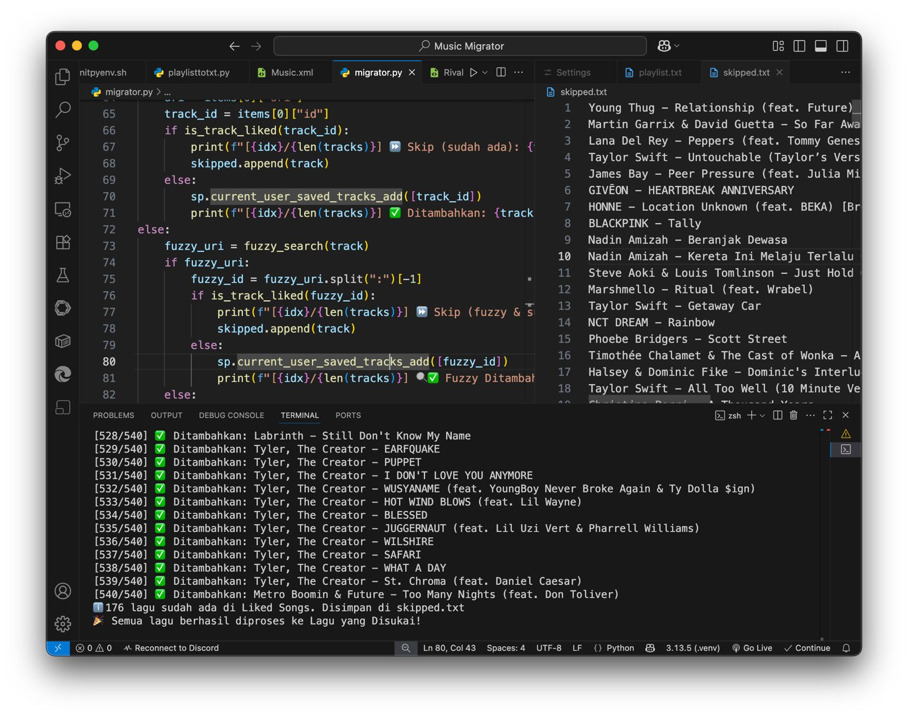

# Migrasi Playlist Apple Music ke Spotify: Panduan Lengkap + Solusi Bug

Ditulis oleh: **Rivaldi**
Terakhir diperbarui: 2025-07-24

---

## 🔥 Tujuan

<p align="center">
  
</p>

Migrasi semua lagu dari Apple Music ke Spotify *tanpa third-party tool* seperti SongShift. Cukup dengan Python dan API Spotify.

---

## 📦 Tools & Library

<p align="left">
  
  
  
  
  
</p>


* Python 3.13 (gunakan virtual environment)
* [Spotipy](https://spotipy.readthedocs.io/) (library Spotify Web API)
* Apple Music (playlist diekspor manual)
* `playlisttotxt.py` untuk parsing XML Apple Music
* `migrator.py` untuk transfer lagu ke Spotify

---

## 🧰 Setup Awal dengan `initpyenv.sh`

Jalankan script berikut untuk setup environment otomatis:

```bash
chmod +x initpyenv.sh
./initpyenv.sh
```

Script ini akan:

* Membuat virtual environment
* Install dependensi: `spotipy`, `requests`
* Aktifkan environment otomatis

---

## 🧠 Alur Migrasi

1. **Ekspor Playlist Apple Music (Mac):**

   * Buka `Music.app`
   * Klik playlist → File > Library > Export Playlist → pilih XML

2. **Jalankan `playlisttotxt.py`:**

   ```bash
   python3 playlisttotxt.py path/to/exported_playlist.xml
   ```

   Output: `playlist.txt`

3. **Jalankan `migrator.py` untuk transfer lagu ke Spotify**

   ```bash
   python3 migrator.py
   ```

   Script akan:

   * Tambahkan lagu ke "Liked Songs"
   * Lewati lagu yang sudah ada
   * Catat lagu gagal di `gagal.txt`
   * Catat yang sudah ada di `skipped.txt`

---

## 🎫 Tentang Spotify Client ID & Secret

Untuk menggunakan script ini, kamu **wajib memiliki akses ke Spotify Developer Console** agar bisa menggunakan API mereka.

Langkahnya:

1. Kunjungi: [https://developer.spotify.com/dashboard](https://developer.spotify.com/dashboard)
2. Login dengan akun Spotify kamu
3. Klik **Create App** → beri nama dan deskripsi
4. Setelah dibuat, kamu akan mendapatkan:

   * **Client ID**
   * **Client Secret**

⚠️ **Masukkan kedua nilai tersebut ke dalam file `migrator.py` secara manual**:

```python
auth = SpotifyOAuth(
    client_id="ISI_CLIENT_ID_KAMU",
    client_secret="ISI_CLIENT_SECRET_KAMU",
    redirect_uri="http://127.0.0.1:8888/callback",
    scope="playlist-modify-public user-library-read user-library-modify"
)
```

Tanpa ini, script tidak akan bisa mengakses akun Spotify kamu.

---

## 📂 Struktur File

```
project-folder/
├── initpyenv.sh
├── playlisttotxt.py        # parser XML ke txt
├── migrator.py             # transfer ke Spotify
├── playlist.txt            # output dari playlisttotxt.py
├── gagal.txt               # lagu yang tidak ditemukan
└── skipped.txt             # lagu yang sudah ada
```

---

## 🛠️ Fitur Script

* Fuzzy search (mirip-mirip judul tetap ditemukan)
* Skip otomatis jika lagu sudah ada
* Retry request jika timeout
* Logging ke file txt
* Otomatis buka "Liked Songs" setelah selesai

---

## 🪲 Bug & Solusi

### 1. **403: Insufficient client scope**

**Masalah:**

```
403 Client Error: Forbidden for url: https://api.spotify.com/v1/me/tracks/contains
```

**Solusi:**
Set scope lengkap:

```python
scope="playlist-modify-public user-library-read user-library-modify"
```

Lalu hapus `.cache*` agar login ulang:

```bash
rm .cache*
```

---

### 2. **Request timeout (ReadTimeoutError)**

**Masalah:**

```
Read timed out. (read timeout=5)
```

**Solusi:**

* Set `requests_timeout=15`
* Tambah `time.sleep(0.5)` antar request
* Retry pencarian lagu hingga 3x jika gagal

---

### 3. **Playlist kosong di Spotify**

**Masalah:** Playlist terlihat kosong padahal sudah berhasil diproses
**Solusi:** Pastikan `migrator.py` menggunakan:

```python
sp.current_user_saved_tracks_add([track_id])
```

Script tidak membuat playlist baru, tapi langsung menambahkan ke "Liked Songs"

---

## ✅ Output Akhir

* Lagu dari Apple Music berhasil dipindahkan ke "Liked Songs"
* Log lagu gagal → `gagal.txt`
* Log lagu yang sudah ada → `skipped.txt`
* Spotify "Liked Songs" terbuka otomatis

---

## ✨ Rencana Pengembangan

* Auto-parse XML tanpa export manual
* GUI drag-n-drop playlist
* Export log ke CSV
* Mode preview/dry-run sebelum transfer

---

## 🤝 Kontribusi

Karena saya tipe orang yang suka gonta-ganti layanan streaming musik dan capek mindahin lagu manual satu per satu, akhirnya saya buat sendiri solusi otomatisasi ini. Prosesnya dirancang fleksibel dan bisa dipakai lagi kapan pun, dengan 3 komponen utama:

* `initpyenv.sh`
* `playlisttotxt.py`
* `migrator.py`

